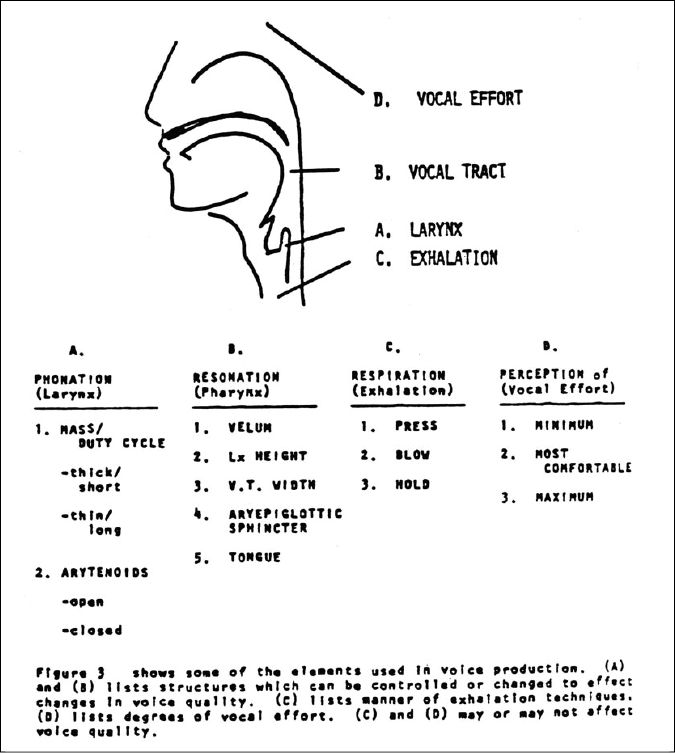
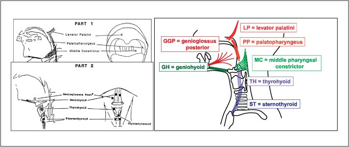
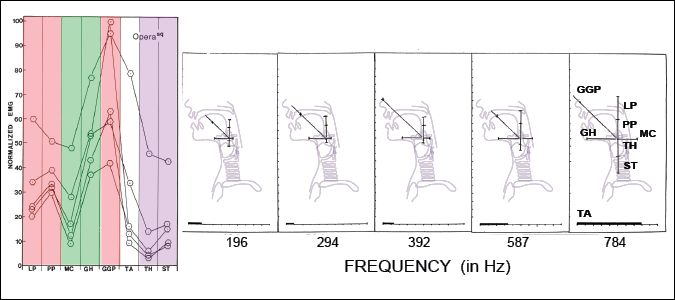

# Estill Voice Model 的起源与发展

> 译者：这篇真的好长好长（20多页……），所以先翻译Figure相关的内容啦（躺

## 指导原则

## 长达十年的研究

## 研究的重叠与 Estill Voice Model 的发展

在 1977 和 1978 年，北部医学中心的耳鼻咽喉学部在一个名为“歌手的发声科学”的教学声乐老师的课程中展现了他们的观察报告。这个课程后来发展成“声乐：声音和科学”，在 1979、1980、1981、1982 和 1984 年间开课。在这段时期，Falsetto 和 Belting 被添加为第五和第六品质（？）。在 1982，Estill 在第 11 届专业发声的保护专题研讨会中，发表了一篇具有重大意义的论文，“声质的控制”，总结了她在这七年间研究的发现。她的研究确定了七种结构在四种发声模式中处于两种情况中的一种。（？）

  
<small>**IMAGE 2-14**: Estill Voice Model 的起源</small>

> 在上面提到的论文和章节的讨论中，我们提出了这样的设想：如果该机制中（？）的结构产生了单独对应每种声质的构造，那一定存在某种独立移动或者控制这些生理结构的方法。（？）如果这是真的，那声音训练可以通过精通一些“必要的关键训练”达成——训练和测试独立运动那些关键结构的练习。因此，声质的生理模型的发展在1984年达到顶峰，形成了一个名为“声乐的技术:专业声乐家的“必修训练（Figure）””的声乐教学体系。一个问题是：这些结构的样子可能各不相同（？），但是有证据证明这些结构可以独立运动吗？（这个证据在几年后才出现。）首先，要有一个可行的可被测试的模型。其次，我们需要可以在这个模型中接受训练的可被测试的受试者。  

1986 年，Estill 担任了 Kiyoshi Honda 的受试者，同时作为他的研究伙伴。她与 Kiyoshi Honda 在康涅狄格州纽黑文的哈斯金斯实验室进行了一系列具有挑战性的肌电图研究（？）。他们记录了六种声质的五种频率下八块肌肉的肌电图(EMG)活动:说话、假声、呜咽、Twang、Opera 和 Belting。

  
<small>**IMAGE 2-15**: EMG 研究的电极布置</small>

  
<small>**IMAGE 2-16**: 运用 “Squillo” 的 Opera 声质的两组 EMG 数据</small>

