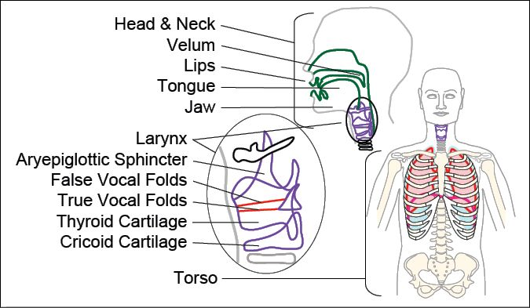
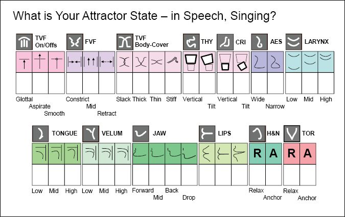

# Estill Voice Training 介绍

## Estill Voice Training™ 练习原则
- 知识就是力量，明白如何正确发声是件好事。
- 声音的产生在声音在被听到*之前* 就开始了，是肌肉的运作让这件事发生的。
- 必须让呼吸对它呼出时遇到的东西做出反应。[（？）](issues.md#1)
- 声音训练在分成三部分的时候是最有效的：创造，艺术，和表演魔术。[（？）](issues.md#1)

在你读这本书的时候，把你的声音想象成一种乐器。像 Jo Estill 对她自己声音的评价一样：

> 你的声音是一种罕见的乐器。你的声音产生的方式就像任何其他乐器一样，但不只是一种乐器。它可以被改变和塑形，像很多不同的乐器那样发音——双簧管，小号，长笛——它是一个微缩的管弦乐队。打着灯笼都找不到像这样好的乐器，但是它在你出生的时候就有了。
> 所以，用这个乐器要知道什么呢？很简单。
> 1. 你要知道你可以控制这个乐器的哪些部分。有三个部分和 13 个组件是你可以学会独立控制的。
> 2. 你要体会到，把每一个部分移动到它们各自的两到三个极限的位置时的感觉。打个比方，这些部分就像其他乐器的琴键一样，当你移动它们，它们的声音就会改变。
> 3. 你要知道，把每一个部分移动到它们各自的两到三个极限的位置时，你的声音会发生什么变化。  
> 
> 而且，你可以通过“制造噪音”学到所有这些东西——所有长大的时候，不被允许的噪音：说话、哭号、呜咽、抱怨、啜泣、叫喊。

## Power-Source-Filter

**Power-Source-Filter (P-S-F) 声音产生理论**是 Estill Voice Model 背后的支柱。根据 P-S-F，声音是依据下面的方式产生的：

1. 声音产生所需的 **Power（动力）** 是气息。肺部产生的气息变成了让真声带震动的能量。
2. 声音的 **Source（来源）** 是真声带。当气息穿过真声带的边缘时，气流速率和声门下压力迫使声带的弹性组织互相靠近和远离。当声带震动时，空气分子靠近又弹开，产生了声波。如果声波是周期性的，它会在声带震动的速度和强度的基础上产生音高和响度。但是，原始的声波听起来其实像嗡嗡声。原始的音色在经过声道空间的共鸣处理后，变得可辨认。
3. 原始的声音的 **Filter（滤波器）** （腔体）是声道——所有声带以上的空间。腔体包括了喉部、咽部、口腔、鼻子的空间。声道中的所有腔体都为共鸣做出了贡献。当空间改变形状时，它的共鸣的频率中心[（？）](issues.md#2)也会改变。在原始的声音经过声道时，所有的这些腔体过滤掉了让声音听起来像嗡嗡声的频率，使共振峰突出，从而令声音显现。[（？）](issues.md#2)这一过滤过程产生了你独特的音质，以及你用来沟通的元音和辅音。

来自 Power, Source, 和 Filter 的贡献，奠定了决定 Estill Voice Model 理论最重要的 13 种生理结构的基本原理。比起传统声乐教学中不客观的描述性语言，Estill 选择了在教学中使用科学术语。  

  
<small>**IMAGE 3-1**: Estill Voice Training 中包括的结构</small>

Estill 的研究表明，这 13 个结构的移动都能在音质中产生明显的，能被听见、感觉和看见的改变。她在《Estill Figures for Voice》中运用了控制和学习发声肌肉运动的原则，对每个结构进行独立的精确控制的训练。她的 Estill Voice Training 练习原则强调了她针对改善说话和表演时的声音表现的创新性的方法。  

## 肌肉控制学习和稳定态

学习发声肌肉控制的技巧要解决很多挑战。在任何肌肉控制的项目里，运动是通过反馈来改进的。在大多数情况，进步是通过客观的测量来衡量的——“我冲刺的时间少了三秒。”“这次比赛我拿到更高的分数了。”“我能用正确的指法弹奏所有大调和小调了。”但是，在声乐里，很难定义一个客观的目标，而且几乎所有的评判都是主观的。“我喜欢那种声音和感觉吗？”“我的听众的反响好吗？”“这样的声音适合这个职业吗？”当我们独自练习时，所有的反馈都是含混不清的。我们所听见自己的声音，和别人听见我们的声音很不一样。我们看不见自己的解剖结构，而且很难感觉哪一部分在移动。我们可以举起自己的手臂，而且闭着眼睛也知道它在哪；然而不管我们闭不闭眼，不要说感觉了，我们连身体“制造声音”的那个部分的名字都叫不出来。而 Estill Voice Training 告诉了我们那些部分的名字，多样的用于估测进步的反馈机制（听-感-看），和用于特定目标的练习。  

为了提供详细的基于 Craft 的练习，Estill Voice Training 采用了[动力系统理论](https://zh.wikipedia.org/wiki/动力系统理论)。在 EVT 中，自然而然的用嗓方式称为稳定态 (attractor states)。改变这些用嗓方式的是任务和环境。你被要求过在你音域的极限，或者用你不熟悉的风格歌唱吗？你只会在浴室或者车子里才会进入状态吗？理解歌唱稳定态对我们找到成为歌唱专家路途中的练习方法有很大帮助。  

当学生练习 EVT 的 Figure 时，我们鼓励学生去发现他们在说话或唱歌时的稳定态（用嗓方式）。产生这些音质的习惯让一些 Figure 选项比其他的更容易找到，以及让一些音质比其他的更容易发出。如果你在一个大嗓门的家庭长大，你可能会发现唱一首柔和的摇篮曲很困难。这说明在伴随你成长而来的稳定态中，厚声带（Thick True Vocal Fold: Body-Cover）发声模式需要转变为薄声带发声模式（Thin）（请参阅 真声带 第85页）。

  
<small>**IMAGE 3-2**: 一次 Estill Voice Training 练习的表格</small>

Estill 在一个不允许她大哭的家庭长大。领悟到低声哭泣让她的声音变得动听这件事，推动了她不断发现并形成了 Estill Voice Model。她的“哭泣”实际上是一种稳定态。她研究了许多喉部的自然行为，并且观察到它们有一些是有益的，但其他的是有害的。喉部在一个人开心，难过，恐惧或者焦虑的时候表现是不一样的。Estill 的悲伤锻炼了她的身体呈现一种稳定态：收缩假声带（打开喉咙）和降低喉部（令音色温暖暗哑 (darked)）。而这种行为产生的音色在古典声乐标准里被认为是“美丽的”。  

她对普遍情绪的稳定态的深远理解，引领她研究和发展了不被艺术和文化基础约束的生理模型。如同 Estill 所说，“如果每个人都能哭，那么每个人都能歌唱。”Estill 也说过，“歌唱是不自然的艺术”，因为我们为了说话和唱歌操纵了我们原本自然的呼吸。我们必须学会用有意识地控制有益的行为来取代对声音有负面影响的喉部自然行为。EVT 提供了在复杂的歌词和乐曲中保持这种控制的策略。我们不仅要通过 Figure 学会控制可动的器官，还要在极限的音高和响度练习所有 Figure 选项。在 EVT 中，Effort 是把自然行为转变成可控的 Craft 的钥匙，Craft 来表现 Artistry，并且 Artistry 到 Performance Magic（请参阅 Craft, Artistry & Performance Magic 第34页）。

## 肌肉控制学习和手势

Estill 对发声肌肉控制学习革命般深刻的洞见不仅涉及稳定态，同时也包括了对手势的革新性使用。早在领先的研究发现手势和增强学习的关系之前，Estill 就已经把每一个 Figure 和一个特定的，模仿声道内神秘而隐蔽的变化的手势结合起来了。EVT 的学生得以通过手势信号更加便利地学习 Figure 的声音和移动。举个例子，声门真声带（Glottal True Vocal Fold）的手势信号：Onset/Offset 是食指和第二指紧密闭合，代表声带闭合。
手势在说话、语言和其他社会项目的学习中都很有用，比如系鞋带和处理复杂的数学和科学问题。研究已经表明，在我们学习新的东西时，手势可以起到减轻记忆负担和表现言语难以体现的复杂思想的作用。手势也被发现在连接视觉和语言脑区上有着长期的增强作用。尽管 Estill 初衷仅仅是探寻如何表现歌手看不见的东西的方法，她的 Figure 手势信号实际上提供了另一个机制来更加方便地进行专注和谨慎的声音练习。通过在练习中使用手势信号，歌手们得以更快地达成练习目标，并且在康复、朗诵和歌唱中把这些改变保留下来。嗓音治疗师、老师和指挥能够通过手势信号来指示学员做出即时改变，避免了冗长的语言。